# Getting Started with Grasshopper Modeling using C#
Meetupで開催しているTokyo AEC Industry Dev Groupのハンズオンの資料置き場となります。
本ハンズオンではC#コンポーネントを使ってRhinoCommon APIを利用してGrasshopperのモデリングをする際の基礎を教えます。このドキュメントはそのレジュメです。

This is a file repo for the hand on lecture held on a group called Tokyo AEC Industry Dev Group on Meetup. I'll teach a basics of Grasshopper modeling using C#  with RhinoCommon API in this hands on lecture. This document is a resume for your reference.

## 必要なもの / Requirements

- Rhino 6
- Grasshopperの多少の経験 / A little bit of experience with Grasshopper

## レファレンス / References

- Rhino Developer Docs: https://developer.rhino3d.com/
- RhinoCommon Guides: https://developer.rhino3d.com/guides/rhinocommon/
- Grasshopper Guides: https://developer.rhino3d.com/guides/grasshopper/
- RhinoCommon API: https://developer.rhino3d.com/api/RhinoCommon/html/R_Project_RhinoCommon.htm

## なぜコーディングでモデリング？ / Why do modeling using code?

人によって理由はそれぞれだと思いますが、自分が考えられる点としては次のようなものが考えられます。

- パラメトリックモデルをパッケージ化できる
- プラグイン化してコンポーネント化もできる
- ビジュアルネットワークと比べてすっきりするので見やすい
- 便利なコーディング技術が使える（クラスとか）
- Anemoneのようなプラグインなしでループや条件分岐ができる
- フラクタル形状などをつくるのに利用する再帰計算もプラグインなしでできる
- データの管理がしやすい
- 必要であればC#の外部ライブラリが使える（Math.NETとか）
- 書き方によってはビジュアルプログラミングよりも速い計算結果を得られる
- 外部のアプリからRhinoのモデリング関数を利用したいとき必要（compute.rhino3dやRhino.Insideなどを利用するとき）

---

- Parametric models can be packaged.
- You can create your own plugin with your parametric model component.
- It's tend to be easier to see because it's cleaner than a visual network.
- You can use some useful coding concepts (like classes).
- You can use loop and conditions without plugins like Anemone.
- You can also do recursion without plugins which can used to create fractals shapes.
- It's easy to manage data.
- You can use an external C# library if you need to (like Math.NET).
- In some cases you can get faster results than visual programming.
- Required when you want to use Rhino's modeling functions from an external app (when using compute.rhino3d, Rhino.Inside, etc.)

## でもなんでRhinoCommon API? / But why RhinoCommon API?

Grasshopperでコーディングを利用する際、まずPythonかC#を選ぶことになります。PythonはRhinoCommonのAPIとは別に、RhinoCommonの機能を使いやすいように組み合わせてScriptSyntaxという形で新しい関数を提供しています。そういう意味でPythonのほうが手軽です。C#では基本的にはRhinoCommon APIしか使えないので、Pythonで書いていた同じコードが使えないということはありえます。同じことをやるにしてもより複雑な書き方にもなりえます。なので、入りはPythonでもいいと思っています。ただ、結局Pythonも背後で利用している関数はRhinoCommonのもので、より汎用性の高い関数となっています。つまり細かいジオメトリックな操作をしたい場合はRhinoCommonを結局のところ知っておく必要があるということです。

When using coding in Grasshopper, the first choice is either Python or C#. Python provides a new function in the form of ScriptSyntax that combines RhinoCommon's features in an easy-to-use way, apart from RhinoCommon's API. In this sense, it's easier to use Python, because you can only use RhinoCommon API for C#, so it's possible that you won't be able to use the same code you wrote in Python. It can also be a more complicated way to write the code even if you are doing the same thing. Thus it's okay to use Python as an entry point. However, the functions that Python uses are based on RhinoCommon's API. This means that if you want to do more complicated and controlled geometric manipulation, you ultimately need to know RhinoCommon API.

## まずは作りたいものを探す / Look for what you want to create

コーディングを使ったモデリングの練習として、コーディングによるモデリングが比較的かんたんなモチーフを探します。ルールが抽出しやすい形がいいかと思います。自分がよくやる方法としては、Pinterestのような画像の連想検索サービスを使って興味あるものをブックマークしていきます。今回自分が選んだのは下記URLのシャンデリアの画像です。

As an exercise in modeling with coding, we look for motifs that are relatively easy to model with coding. It would be nice if you could extract the rule from the form. The way I often do it is to use an image association search service like Pinterest to bookmark things that interests me. I chose the image of the chandelier at the following URL this time.

https://www.pinterest.jp/pin/170785010858059762/

## Step 0: Grasshopperでまずモデリング / Modeling with Grasshopper

コーディングがはじめての人はまずGrasshopperだけでモデリングを完結してみるのがいいです。基本的にはコードでやることはこのGrasshopperで作ったネットワークの流れをなぞっていくということになるからです。

If you are new to coding, you should try to complete the modeling with Grasshopper first. Basically, all you have to do with the code is to follow the flow of the network you created with Grasshopper.

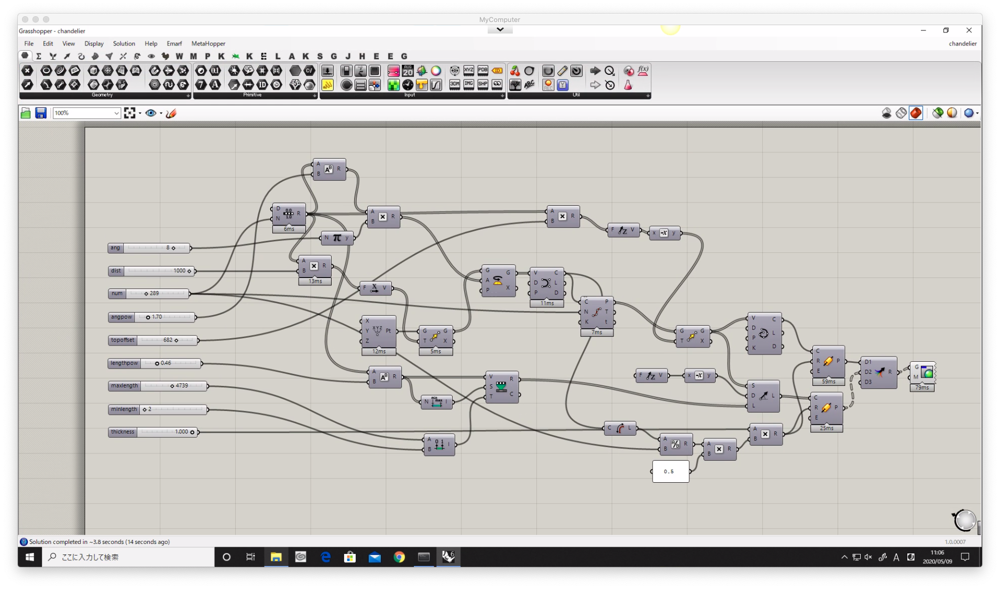
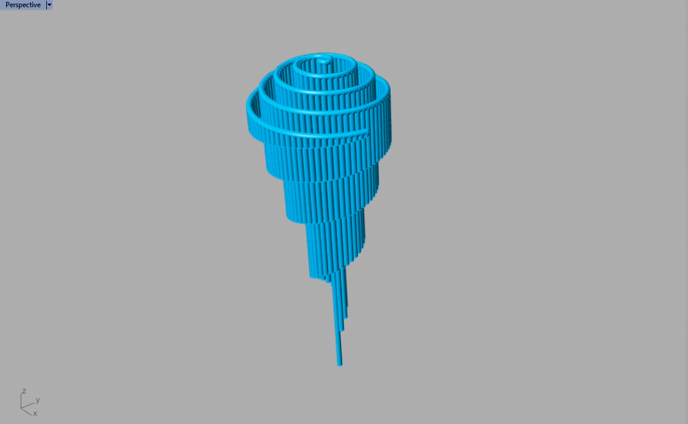


## Step 1: ポイントをふたつ作る / Create two points

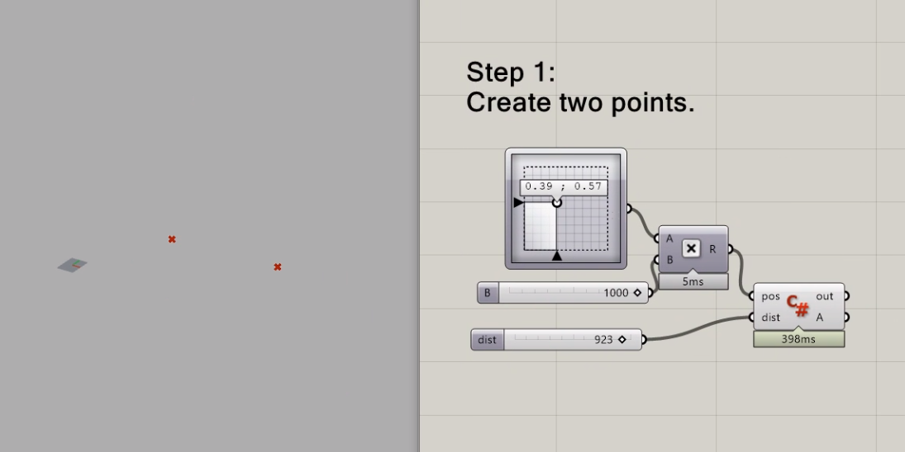

```csharp
private void RunScript(Point3d pos, double dist, ref object A)
  {
    // Create two points in a list.
    var pts = new List<Point3d>(){
        pos,
        pos + new Point3d(dist, 0, 0)
        };

    // output points.
    A = pts;
  }
```

## Step 2: ポイントをふたつ作る / Create two points

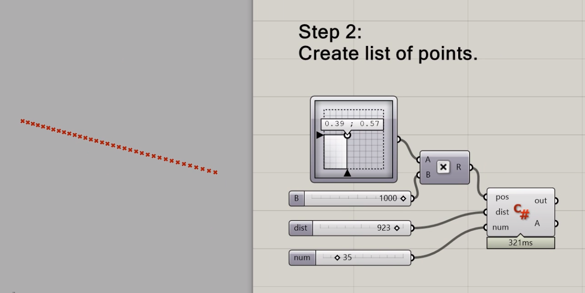

```csharp
private void RunScript(Point3d pos, double dist, int num, ref object A)
  {
    // Create empty list.
    var pts = new List<Point3d>();

    // Use loop to continuously create points inbetween two points.
    for(int i = 0; i < num; i++){
      var newpos = pos + new Vector3d(dist * i / (num - 1.0), 0, 0);
      pts.Add(newpos);
    }

    A = pts;
  }
```

## Step 3: ポイントを回転して螺旋を作る / Rotate points to create spiral

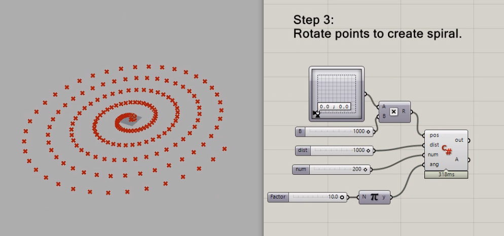

```csharp
private void RunScript(Point3d pos, double dist, int num, double ang, ref object A)
  {
    var pts = new List<Point>();
    for(int i = 0; i < num; i++){
      // Convert integer i to t in a range 0.0-1.0.
      double t = i / (num - 1.0);

      var newpos = pos + new Vector3d(dist * t, 0, 0);

      // Create Point geometry from Point3d (location information).
      var newpt = new Point(newpos);
      // Rotate Point geometry iteratively.
      newpt.Rotate(t * ang, Vector3d.ZAxis, pos);

      pts.Add(newpt);
    }

    A = pts;
  }
```

## Step 4: 螺旋形状を変形する / Modify spiral shape

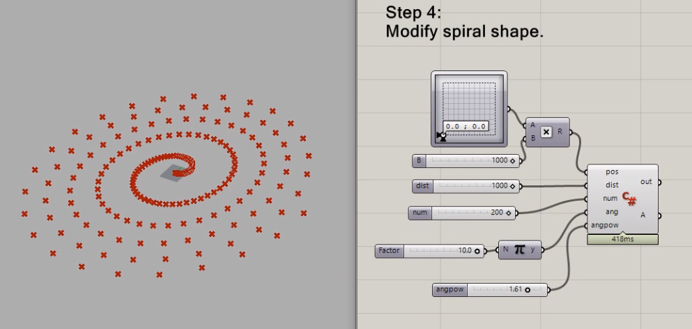

```csharp
private void RunScript(Point3d pos, double dist, int num, double ang, double angpow, ref object A)
  {
    var pts = new List<Point>();
    for(int i = 0; i < num; i++){
      double t = i / (num - 1.0);

      var newpos = pos + new Vector3d(dist * t, 0, 0);
      var newpt = new Point(newpos);

      // User power function to modify t value.
      newpt.Rotate(Math.Pow(t, angpow) * ang, Vector3d.ZAxis, pos);

      pts.Add(newpt);
    }

    A = pts;
  }
```

## Step 5: ポイントから曲線を作る / Create interpolate curve from points

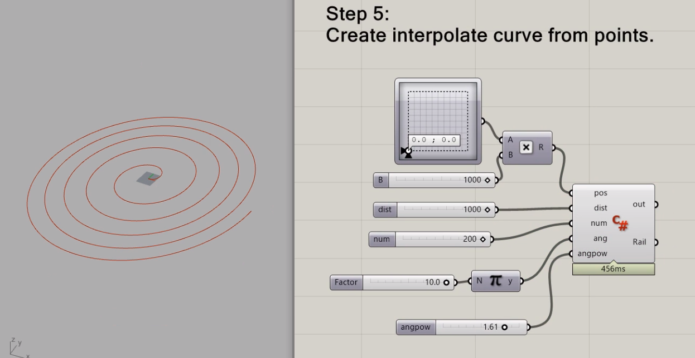

```csharp
private void RunScript(Point3d pos, double dist, int num, double ang, double angpow, ref object Rail)
  {
    var pts = new List<Point3d>();
    for(int i = 0; i < num; i++){
      double t = i / (num - 1.0);

      var newpos = pos + new Vector3d(dist * t, 0, 0);
      var newpt = new Point(newpos);
      newpt.Rotate(Math.Pow(t, angpow) * ang, Vector3d.ZAxis, pos);

      pts.Add(newpt.Location);
    }

    // create interpolate curve from list of points.
    var crv = Curve.CreateInterpolatedCurve(pts, 3);

    // output curve.
    Rail = crv;
  }
```

## Step 6: 曲線を均等に分割する / Divide curve equally

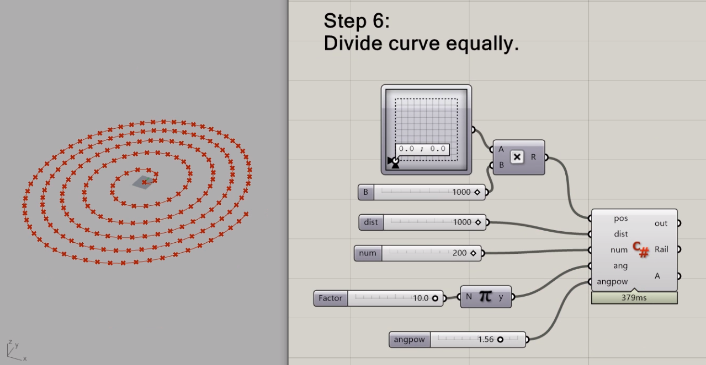

```csharp
private void RunScript(Point3d pos, double dist, int num, double ang, double angpow, ref object Rail, ref object A)
  {
    var pts = new List<Point3d>();
    for(int i = 0; i < num; i++){
      double t = i / (num - 1.0);

      var newpos = pos + new Vector3d(dist * t, 0, 0);
      var newpt = new Point(newpos);
      newpt.Rotate(Math.Pow(t, angpow) * ang, Vector3d.ZAxis, pos);

      pts.Add(newpt.Location);
    }

    var crv = Curve.CreateInterpolatedCurve(pts, 3);

    // create new list to store divided points.
    var newpts = new List<Point3d>();

    // divide curve to get curve parameters.
    var divs = crv.DivideByCount(num - 1, true);
    for(int i = 0; i < divs.Length; i++){
      // get point location using curve parameter.
      var newpos = crv.PointAt(divs[i]);
      newpts.Add(newpos);
    }

    Rail = crv;

    // output divided points.
    A = newpts;
  }
```

## Step 7: 曲線を下方向に移動する / Move curve downward
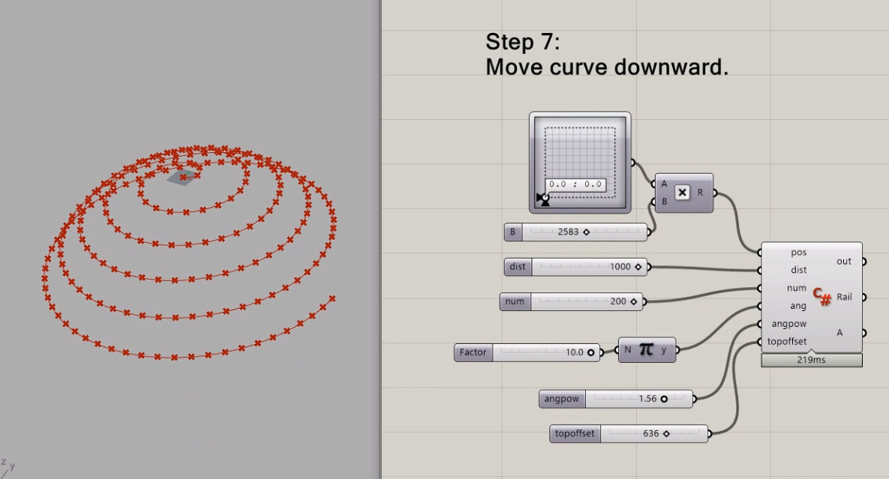

```csharp
private void RunScript(Point3d pos, double dist, int num, double ang, double angpow, double topoffset, ref object Rail, ref object A)
  {
    var pts = new List<Point3d>();
    for(int i = 0; i < num; i++){
      double t = i / (num - 1.0);

      var newpos = pos + new Vector3d(dist * t, 0, 0);
      var newpt = new Point(newpos);
      newpt.Rotate(Math.Pow(t, angpow) * ang, Vector3d.ZAxis, pos);

      pts.Add(newpt.Location);
    }

    var crv = Curve.CreateInterpolatedCurve(pts, 3);

    var newpts = new List<Point3d>();
    var divs = crv.DivideByCount(num - 1, true);
    for(int i = 0; i < divs.Length; i++){
      var newpos = crv.PointAt(divs[i]);
      double t = i / (divs.Length - 1.0);

      // create offset value and move points downward.
      double offset = topoffset * t;
      newpos += new Vector3d(0, 0, -offset);

      newpts.Add(newpos);
    }
    crv = Curve.CreateInterpolatedCurve(newpts, 3);

    Rail = crv;
    A = newpts;
  }
```

## Step 8: ラインを作る / Create lines
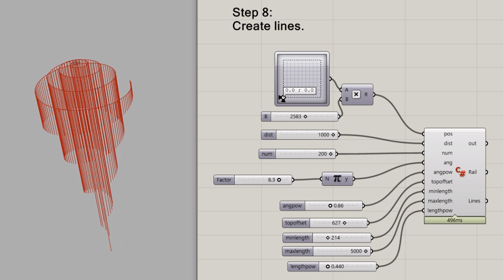

```csharp
private void RunScript(Point3d pos, double dist, int num, double ang, double angpow, double topoffset, double minlength, double maxlength, double lengthpow, ref object Rail, ref object Lines)
  {
    var pts = new List<Point3d>();
    for(int i = 0; i < num; i++){
      double t = i / (num - 1.0);

      var newpos = pos + new Vector3d(dist * t, 0, 0);
      var newpt = new Point(newpos);
      newpt.Rotate(Math.Pow(t, angpow) * ang, Vector3d.ZAxis, pos);

      pts.Add(newpt.Location);
    }

    var crv = Curve.CreateInterpolatedCurve(pts, 3);

    // create empty list to store line curves.
    var lines = new List<Curve>();

    var newpts = new List<Point3d>();
    var divs = crv.DivideByCount(num - 1, true);
    for(int i = 0; i < divs.Length; i++){
      var newpos = crv.PointAt(divs[i]);
      double t = i / (divs.Length - 1.0);
      double offset = topoffset * t;
      newpos += new Vector3d(0, 0, -offset);
      newpts.Add(newpos);

      // calculate line length based on t value together with min / max line length params.
      var len = minlength + (maxlength - minlength) * (1.0 - Math.Pow(t, lengthpow));
      // create LineCurve object from two points.
      var lc = new LineCurve(newpos, newpos + new Vector3d(0, 0, -len));
      lines.Add(lc);
    }
    crv = Curve.CreateInterpolatedCurve(newpts, 3);

    Rail = crv;

    // output lines.
    Lines = lines;
  }
```

## Step 9: ラインからパイプを作る / Create pipe from lines
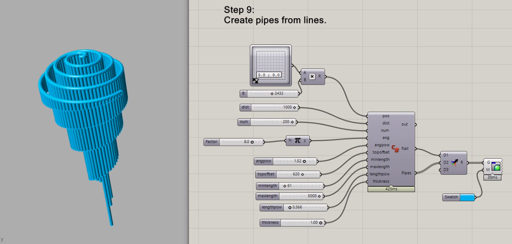

```csharp
 private void RunScript(Point3d pos, double dist, int num, double ang, double angpow, double topoffset, double minlength, double maxlength, double lengthpow, double thickness, ref object Rail, ref object Pipes)
  {
    var pts = new List<Point3d>();
    for(int i = 0; i < num; i++){
      double t = i / (num - 1.0);

      var newpos = pos + new Vector3d(dist * t, 0, 0);
      var newpt = new Point(newpos);
      newpt.Rotate(Math.Pow(t, angpow) * ang, Vector3d.ZAxis, pos);

      pts.Add(newpt.Location);
    }

    var crv = Curve.CreateInterpolatedCurve(pts, 3);

    var lines = new List<Curve>();

    var newpts = new List<Point3d>();
    var divs = crv.DivideByCount(num - 1, true);

    // calculate pipe diameter
    var sepdist = crv.GetLength() / num;
    // create empty list to store pipes.
    var pipeList = new List<Brep>();

    for(int i = 0; i < divs.Length; i++){
      var newpos = crv.PointAt(divs[i]);
      double t = i / (divs.Length - 1.0);
      double offset = topoffset * t;
      newpos += new Vector3d(0, 0, -offset);
      newpts.Add(newpos);

      var len = minlength + (maxlength - minlength) * (1.0 - Math.Pow(t, lengthpow));
      var lc = new LineCurve(newpos, newpos + new Vector3d(0, 0, -len));
      lines.Add(lc);

      // create pipe geometry from line curve
      var pipes = Brep.CreatePipe(lc, sepdist * 0.5 * thickness, true, PipeCapMode.None, true, 0.01, 0.01);
      pipeList.AddRange(pipes);
    }
    crv = Curve.CreateInterpolatedCurve(newpts, 3);
    var rail = Brep.CreatePipe(crv, sepdist * 0.5 * thickness, true, PipeCapMode.Round, true, 0.01, 0.01);

    Rail = rail;
    Pipes = pipeList;
  }
```

## Tokyo AEC Industry Dev Group
https://www.meetup.com/Tokyo-AEC-Industry-Dev-Group/

## Youtube Link
https://youtu.be/K4mApjtdPBg
